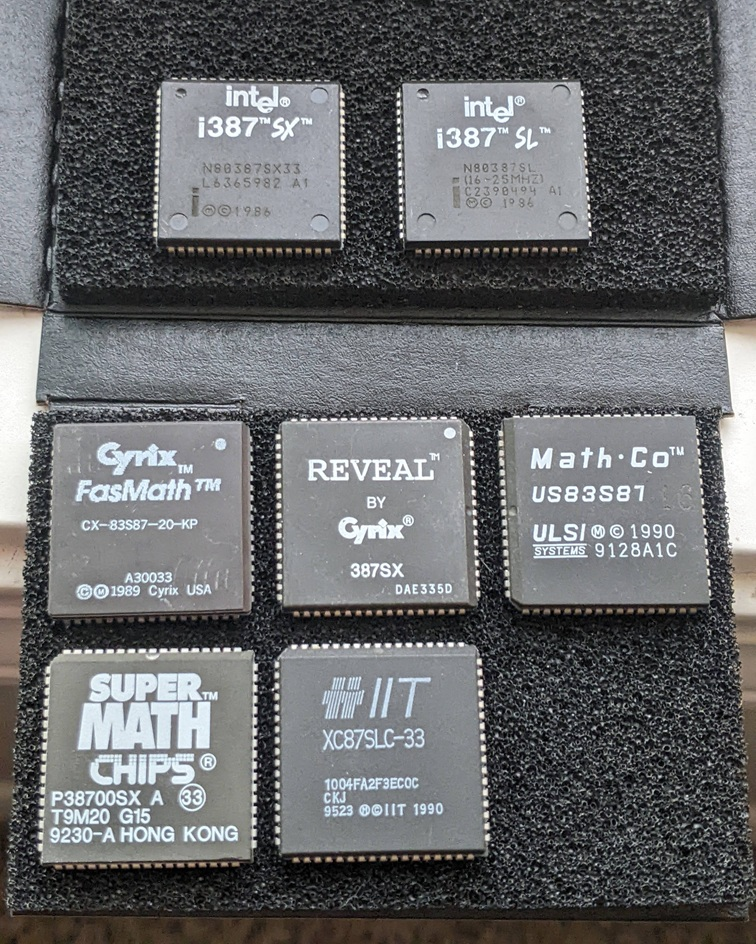
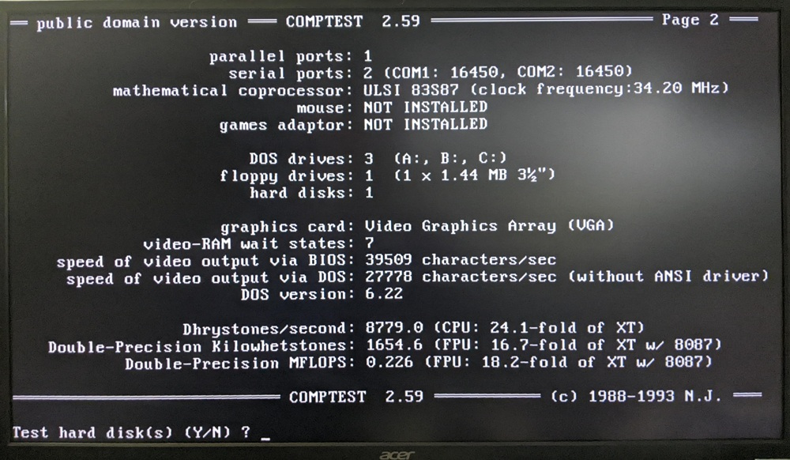
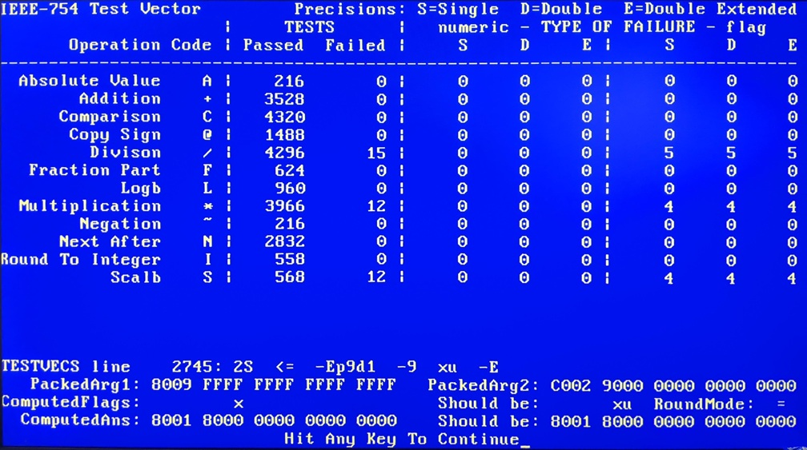
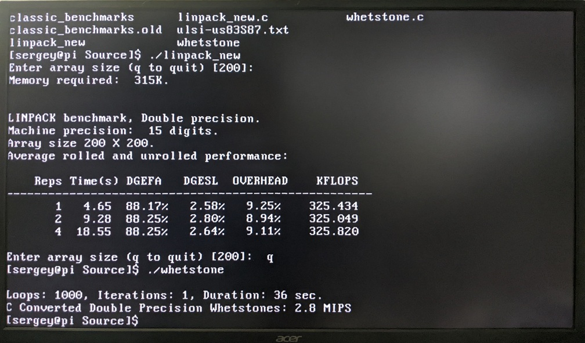
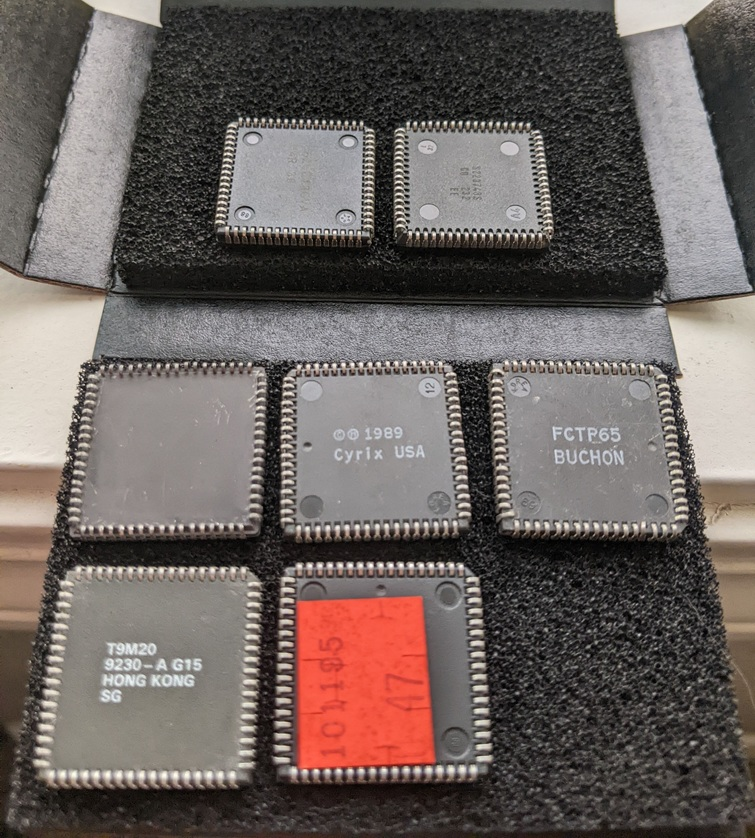

# 387SX Floating-Point Unit Benchmark Results

## Test Setup

* Hardware:
  * Motherboard: [ESC WH386SX](https://theretroweb.com/motherboards/s/ecs-wh386sx)
  * CPU: AMD Am386SX/SXL-33 (33 MHz)
  * Cache: 64 KiB
  * DRAM: 16 MiB
  * Cirrus Logic CL-GD5420 512 KiB SVGA
* Software:
  * MS-DOS 6.22; benchmarks:
    * COMPTEST 2.59: Double-Precision Kilowhetstones; Double-Precision MFLOPS
    * IEEE-753 Test Vector
  * RedHat 4.2 Linux; benchmarks:
    * Whetstone: Double-Precision Whetstones: MIPS
    * linpack_new; array size 200 x 200: KFLOPS

## FPUs Tested

* Intel i387SX
  * Part number: N80387SX33
  * Date/Lot: L6365982 A1
* Intel i387SL
  * Part number: N80387SL (16~25MHz)
  * Date/Lot: C2390494 A1
* ULSI Systems MathCo
  * Part number: US83S87
  * Date/Lot: 9128A1C
* IIT
  * Part number: XC87SLC-33
  * Date/Lot: 1004FA2F3EC0C CKJ 9523
* Chips and Technologies - Super Math
  * Part number: P38700SX A (33)
  * Date/Lot: T9M20 G15, 9230-A HONG KONG
* Cyrix - Reveal
  * Part number: 387SX
  * Date/Lot: DAE335A
* Cyrix - FasMath
  * Part number: CX-83S87-20-KP
  * Date/Lot: A30033
 

## Benchmark Results 

FPU                 | COMPTEST (Kilowhetstones) | COMPTEST (MFLOPS) | Whetstone (MIPS) | linpack_new (KFLOPS)      | IEEE-753 Test Vector Failed Tests | Notes
--------------------|---------------------------|-------------------|------------------|---------------------------|-----------------------------------|-----------------------------------------
Intel i387SX        | 1603.2                    | 0.225             | 2.7              | 339.934, 339.514, 338.468 | None                              | COMPTEST reports 24.45 MHz FPU frequency
Intel i387SL        | 1601.6                    | 0.225             |                  |                           | None                              |
ULSI MathCo US83S87 | 1654.6                    | 0.226             | 2.9              | 339.095, 340.355, 340.355 | Division, Multiplication, Scalb   |
IIT XC87SLC-33      | 1703.9                    | 0.225             | 2.8              | 325.434, 325.049, 324.820 | None                              | COMPTEST reports 47.16 MHz FPU frequency
Chips Super Math P38700SX A 33 | 1828.6         | 0.232             | 3.1              | 337.428, 338.677, 338.885 | None                              |
Cyrix Reveal 387SX  | 1834.9                    | 0.229             | 3.0              | 334.144, 334.959, 334.348 | None                              |
Cyrix FasMath CX-83S87-30-KP | 1880.1           | 0.232             |                  |                           |                                   |

## More Images

