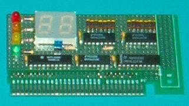
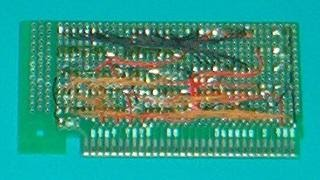

# ISA POST Card

This is my implementation of a standard Port 80h POST Card. It could be useful for PC repairing or troubleshooting.

It uses a binary-to-digital decoders, and not able to display HEX numbers (A-F), instead some figures are displayed. I found the [SN75LS47](https://www.ti.com/product/SN74LS47) datasheet useful for decoding these "figures".

## Downloads

* Schematic: [PDF](post_card.pdf), [EAGLE EDA](post_card.sch)
