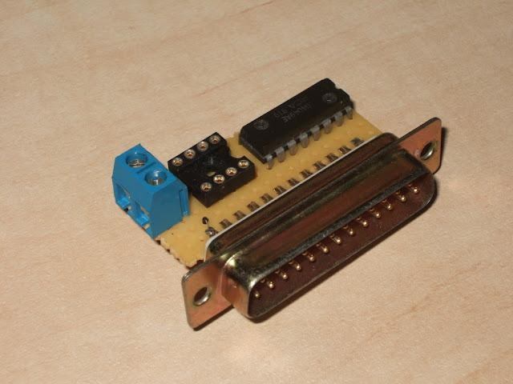

# SPI Flash ROM Programmer

## Introduction

Many recent motherboards use SPI flash memory instead of regular (parallel) NOR flash devices. And in unfortunate case of failed BIOS upgrade, it's no longer possible to use good old "hot swap" flash programming method, because SPI is not socketed.

I designed a very simple SPI flash programmer, that includes only one IC. But yet it fully functional and allows user to read, write and erase SPI flash devices.

The programmer's software supports only [SST25VF016B](https://www.microchip.com/en-us/product/sst25vf016b) devices, found on many Intels' motherboards. But I believe that only minor code modifications are required to add support for other types of SPI.

## Hardware

PC's parallel port is used to control the programmer (I know that some recent motherboards don't have such a port, but I am sure that you still have some older system with such port around ;-).

The only (active) component in the programmer is a CD4049UB inverting buffer IC. The programmer requires a 3.3V power supply. You can find this voltage on an ATX power supply (orange wires) installed in your computer, or simply use a pair of AA batteries.

## Software

Programmer's software is written for Linux. It uses some sample SPI programming code provided by SST.

Following modes of operation are supported: id,  read, write, and erase.

* id - reads JEDEC ID from the device, and be used to test that programmer is functioning correctly, and SPI flash is in working condition.
  * Usage: ./spi_programmer id
* read - reads content of SPI, currently it reads exactly 2MiB of data (because SST25VF016B is 2MiB device, could be easily changed in the source code).
  * Usage: ./spi_programmer read Old_BIOS.bin
* write - writes content of a file to an empty (previously erased) SPI device. It will write exactly 2MiB of data, and expects the input file to have this size.
  * Usage: ./spi_programmer write New_BIOS.bin
* erase - erases SPI device.
  * Usage: ./spi_programmer erase

You may notice that verify mode is not provided, but you can easily verify a device by reading its content and comparing it to the original file (diff is your friend).

See attachments for programmer's software source code.

## Few tips

* Configure parallel port in a Standard (unidirectional) mode, on address 0x378 (this is defined in parport_driver.h).
* Perform an id operation after connecting an SPI device, you should receive a valid JEDEC ID (not 0xffff). If you're getting 0xffff something is wrong with your programmer, SPI device, or computer settings (like parallel port address and mode).
* Use following programming sequence: id, erase, write, read, compare data that you've read in the last step with the data you've programmed into device.
* Motherboards usually employ a surface mounted type of SPI. Take extreme care when unsoldering them, don't overheat IC and PCB traces, do not apply to much force. You can use 0.5mm wire (telephone wire?!) to connect surface mount device to a DIP socket. (Or you can use a special adapter).

## Downloads

* Schematic: [EAGLE EDA](spi_programmer.sch)
* Software: [spi_programmer-0.2.tar.gz](spi_programmer-0.2.tar.gz)
