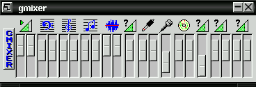

# gmixer

gmixer was my attempt to create a simple, cute looking, not bloated, but yet fully featured audio mixer for OSS sound architecture (found on Linux and FreeBSD).

It was a kind of a success, I was using it for a long time, until OSS was replaced by ALSA on the major Linux distributions. It also was ported to FreeBSD and was shipped with FreeBSD distribution for some time.

Now probably it presents a historical interest only.

## Download

* Version 0.98c [gmixer-0.98c.tar.bz2](gmixer-0.98c.tar.bz2)
