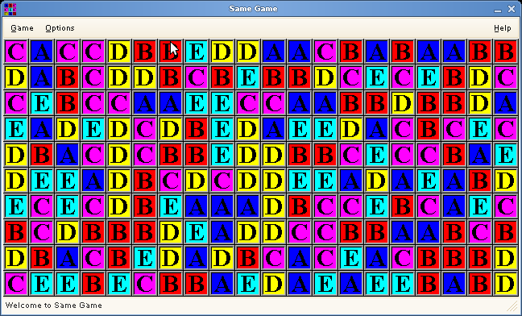

# gsame

gsame is a GTK+ implementation of the famous "Same Game". It was a very popular game while I was in the military, so I had to write a Linux port for it, to play on my computer ;-)

## Download

* Version 1.0pre2 [gsame-1.0pre2.tar.bz2](gsame-1.0pre2.tar.bz2)
* Version 1.0pre1 [gsame-1.0pre1.tar.bz2](gsame-1.0pre1.tar.bz2)
